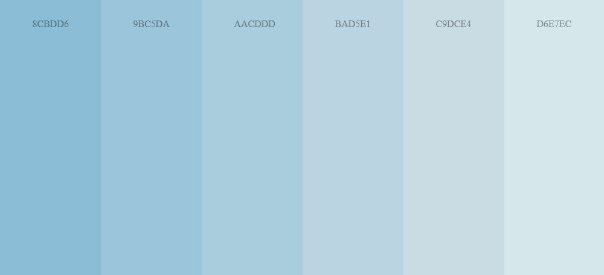
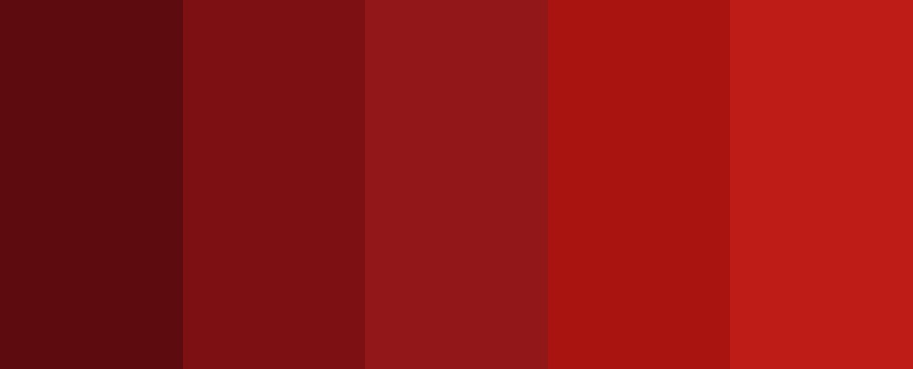
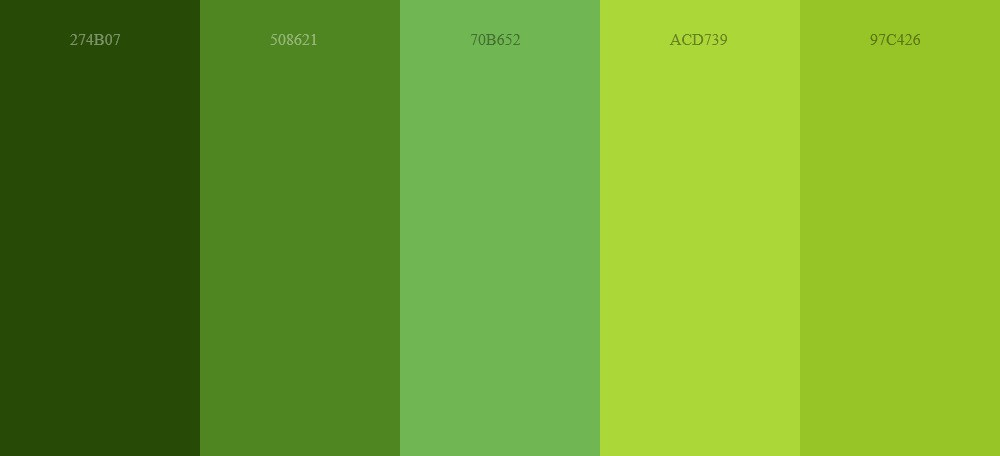

# Web gradient picker

A simple React application for testing Vite as well as Tailwind CSS features and customization.

## Project purpose

This project serves as a technical test for:
- React : UI framework
- Tailwind CSS : CSS framework
- Vite : Build tool
- Vercel : Online hosting  
- Responsive design and custom component development
- Frontend deployment
- Familiarization with web utility and deployment

## Available gradients
All gradients are from [Schemecolor](https://www.schemecolor.com/)

### Base (gray)

### Red

### Green

### Blue

