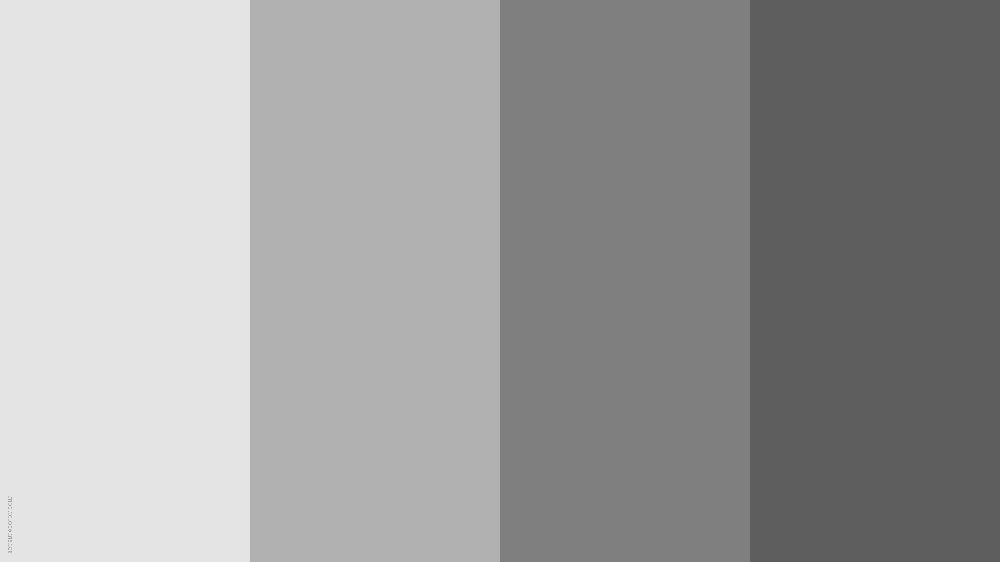

# Web gradient picker
A very simple and interactive React single-page application with Vite and Tailwind CSS letting the user chose the page background animation from a set of defined gradients

## Demonstration
You can find the website [here](https://web-gradient-picker.vercel.app/)

## Key features
* Dynamic Theming: Instant switching between animated gradient themes  
* Animation: Smooth background movement with optimized keyframe movement  
* Modern UI: Transparent control panel with a glass effect and a responsive tooltip  
* Customization: Custom color palette for maintainable and consistent styling  
* Technologies Used: React, Tailwind CSS, Vite and Vercel

## Project purpose
This project was made to work on my web development skills 

It made me discover and work with basic dynamic state control with React as well as learn to compose styles quickly, implement responsive design and configure custom themes for colors and utilities with Tailwind  

## Available gradients
The application comes with five uniquely designed color themes, all gradient color codes from [Schemecolor](https://www.schemecolor.com/)

| Gray (default) | Pink | Purple | Blue | Rainbow |
:-------:|:-------:|:-------:|:-------:|:-------:
|  |  |  |  |  |
